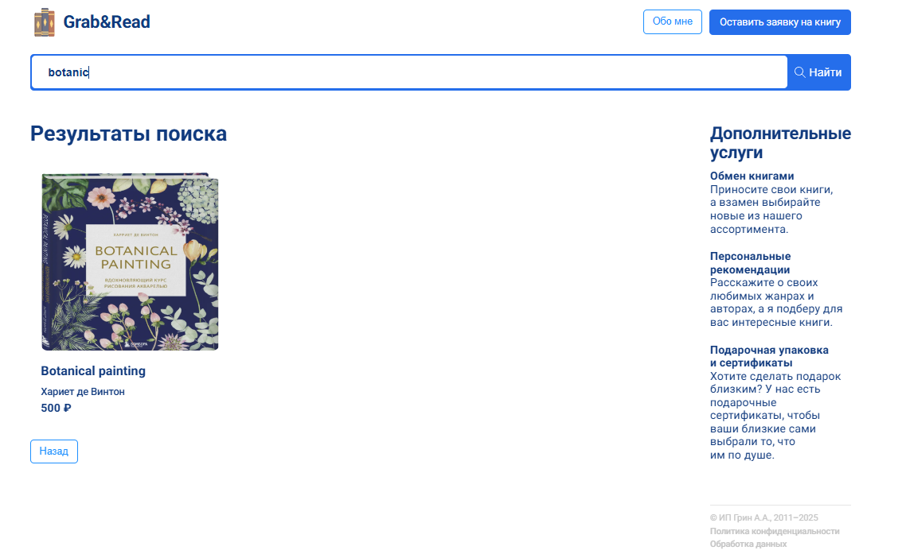
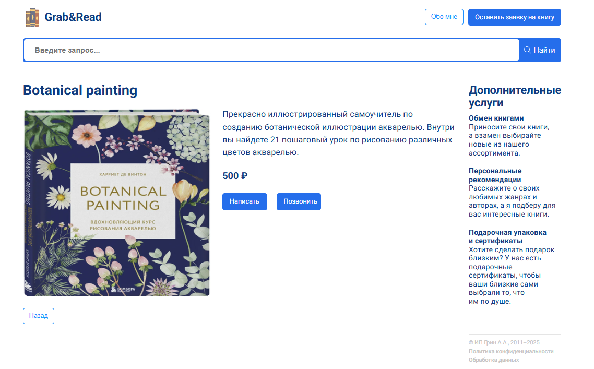

# Grab&Read

Grab&Read - это онлайн-магазин подержанных книг, где пользователи могут находить, покупать и обменивать книги.

## 📖 О проекте

Этот веб-приложение позволяет пользователям:

- Искать книги по названию и цене.
- Просматривать подробную информацию о каждой книге.
- Добавлять книги в избранное.
- Получать персональные рекомендации.

## 🚀 Запуск проекта

### 1. Клонирование репозитория

```sh
git clone https://github.com/OllgaKharina/Grab-Read.git
cd Grab-Read
```

### 2. Установка зависимостей

```sh
npm install
```

### 3. Запуск локального сервера

```sh
npm run dev
```

После запуска сервер будет доступен по адресу `http://localhost:5173/`.

## 🛠️ Технологии

- **React + Vite** 
- **React Router**
- **Git & GitHub** 

## 📂 Структура проекта

```
📦 Grab-Read
├── 📂 src
│   ├── 📂 components  # Компоненты приложения
│   ├── 📂 pages       # Основные страницы
│   ├── 📂 styles      # Глобальные стили
│   ├── 📜 main.jsx    # Главный файл React-приложения
├── 📜 package.json    # Список зависимостей
├── 📜 README.md       # Описание проекта
```

## 📌 Функциональность

- 🔍 **Поиск** – книги можно искать по названию или цене.
- 📑 **Страница книги** – отображает подробную информацию.
- 🏠 **Главная страница** – список всех доступных книг.
- 🔙 **Кнопка "Назад"** – возвращает пользователя к результатам поиска.

## 📷 Скриншоты

### 🔹 Главная страница


### 🔹 Страница поиска


### 🔹 Страница товара


### 🔹 Страница "Об авторе"


## 💡 Улучшения в будущем

- Добавление корзины покупок 🛒
- Авторизация пользователей 🔐
- Фильтрация книг по жанрам 📚

## 🤝 Контакты

- GitHub: [мой профиль](https://github.com/OllgaKharina)
- Email: olxarina@yandex.ru


